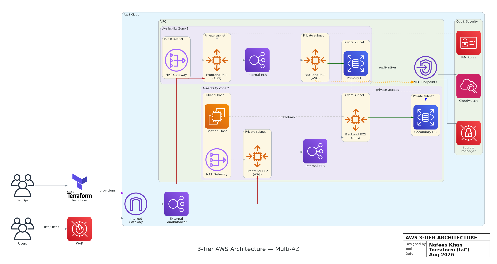

# Goal Tracker — AWS 3-Tier Infrastructure with Terraform

> **Production-style AWS infrastructure for a containerized Goal Tracker application, provisioned entirely with Terraform and designed around network isolation, horizontal scaling, secure database access, and operational observability.**

[](https://www.terraform.io/)
[](https://aws.amazon.com/)
[](https://www.docker.com/)
[](https://go.dev/)
[](https://nodejs.org/)
[](https://www.postgresql.org/)


<p align="center">
  
</p>

## Executive Summary

This project deploys a **3-tier web application on AWS** using **Terraform modules** and **EC2 Auto Scaling Groups**:

- **Presentation tier:** Node.js frontend containers running on private EC2 instances behind a public Application Load Balancer.
- **Application tier:** Go/Gin REST API containers running on private EC2 instances behind an internal Application Load Balancer.
- **Data tier:** PostgreSQL on Amazon RDS inside isolated database subnets.

The platform is intentionally structured to demonstrate core DevOps and cloud engineering practices rather than simply running the application on a single VM.

### What the infrastructure demonstrates

| Area | Implementation |
|---|---|
| Infrastructure as Code | Terraform with reusable modules |
| Networking | Custom VPC, public/private/isolated subnet tiers across 2 AZs |
| Traffic Management | Public ALB + internal ALB |
| Compute | EC2 Launch Templates + Auto Scaling Groups |
| Scaling | Target-tracking CPU scaling at 70% |
| Database | Private PostgreSQL RDS with encrypted storage and backups |
| Secrets | AWS Secrets Manager + runtime retrieval from backend instances |
| Access | Bastion host + SSM-capable EC2 IAM role |
| Containers | Multi-stage Docker images with minimal runtime bases |
| Operations | CloudWatch logs, metrics, alarms, and EC2 detailed monitoring |
| Local environment | Docker Compose with PostgreSQL |
| Application observability | Prometheus-compatible `/metrics` endpoint in the Go API |

---

## Architecture

### AWS 3-Tier Multi-AZ Architecture

The following diagram shows the deployed infrastructure design, including the public entry point, private application tiers, database layer, administrative access, and AWS operational services.

<p align="center">
  
</p>

### Request flow

```text
Internet
   │
   ▼
Public Application Load Balancer
   │
   ▼
Frontend Auto Scaling Group
(private frontend subnets)
   │
   │ HTTP → internal ALB
   ▼
Internal Application Load Balancer
   │
   ▼
Backend Auto Scaling Group
(private backend subnets)
   │
   │ PostgreSQL :5432
   ▼
Amazon RDS PostgreSQL
(isolated database subnets)
```

### Supporting services

```text
                         ┌─────────────────────┐
                         │ AWS Secrets Manager  │
                         │ DB credentials       │
                         └──────────┬──────────┘
                                    │
                                    ▼
┌──────────────┐           ┌─────────────────────┐
│ EC2 IAM Role │──────────▶│ Backend EC2/ASG     │
│ SSM/Logs/    │           │ runtime secret      │
│ Secrets      │           │ retrieval           │
└──────────────┘           └─────────────────────┘

┌──────────────┐
│ CloudWatch   │◀──── EC2 logs, metrics, alarms
└──────────────┘

┌──────────────┐
│ Docker Hub   │──── image distribution
└──────────────┘
```

> **Architecture note:** the supplied diagram is the project's design artifact. The Terraform implementation is the source of truth: it currently uses **Docker Hub** rather than ECR, does not provision an AWS WAF resource, and manages the database through a single `aws_db_instance` with optional RDS Multi-AZ rather than a manually managed primary/secondary topology.


## Why the architecture is structured this way

### 1. Network isolation

The VPC is split into four subnet classes across two Availability Zones:

```text
VPC: 10.0.0.0/16

AZ-a                         AZ-b
────────────────────────────────────────────────────
Public       10.0.1.0/24     10.0.2.0/24
Frontend     10.0.11.0/24    10.0.12.0/24
Backend      10.0.21.0/24    10.0.22.0/24
Database     10.0.31.0/24    10.0.32.0/24
```

The design keeps the application and database layers away from direct internet ingress.

### 2. Two load-balancing layers

**Public ALB**
- Internet-facing.
- Accepts HTTP on port `80`.
- Can optionally serve HTTPS when a certificate ARN is supplied.
- Routes traffic to frontend instances on port `3000`.

**Internal ALB**
- Internal-only.
- Receives frontend-to-backend traffic.
- Routes requests to backend instances on port `8080`.

This creates a clear boundary between the public presentation tier and the private API tier.

### 3. Auto Scaling instead of fixed servers

Both frontend and backend use EC2 Auto Scaling Groups.

| Tier | Min | Desired | Max | Scale metric |
|---|---:|---:|---:|---|
| Frontend | 2 | 2 | 4 | Average CPU = 70% target |
| Backend | 2 | 2 | 6 | Average CPU = 70% target |

Instances are registered with their ALB target groups and use ELB health checks.

### 4. Private database tier

RDS PostgreSQL is:

- not publicly accessible
- placed in dedicated database subnets
- protected by a dedicated security group
- encrypted at rest
- configured for automated backup retention
- configured to export PostgreSQL/upgrade logs to CloudWatch

The database security group only permits PostgreSQL traffic from the backend security group.

---

## Security Model

Security is implemented as multiple layers rather than relying on a single perimeter.

### Security group flow

```text
Internet
   │
   │ 80 / 443
   ▼
ALB Security Group
   │
   │ 3000
   ▼
Frontend Security Group
   │
   │ 80 → Internal ALB
   ▼
Internal ALB Security Group
   │
   │ 8080
   ▼
Backend Security Group
   │
   │ 5432
   ▼
RDS Security Group
```

### Administrative access

The project provisions a dedicated bastion host in a public subnet.

```text
Administrator
     │
     │ SSH :22
     ▼
Bastion Host
     │
     │ SSH :22
     ▼
Private Frontend / Backend instances
```

The EC2 IAM role also includes **AWS Systems Manager Session Manager** support, enabling an operational path that does not depend exclusively on inbound SSH.

### EC2 instance hardening

Launch templates and the bastion configure:

- IMDSv2 (`http_tokens = required`)
- encrypted `gp3` root volumes
- instance monitoring
- IAM instance profiles
- automatic Docker installation
- reproducible user-data bootstrapping

### Secrets

Database credentials are generated with Terraform's `random_password`, stored in **AWS Secrets Manager**, and retrieved by backend instances at startup.

The backend user-data flow is:

```text
EC2 instance
    │
    ▼
AWS CLI
    │
    ▼
Secrets Manager
    │
    ▼
DB username/password/host/port/name
    │
    ▼
Docker environment variables
    │
    ▼
Go API → PostgreSQL
```

> **Hardening note:** the current development environment passes `secrets_arns = ["*"]` to the IAM module and uses a configurable SSH CIDR. A production deployment should scope the Secrets Manager policy to the exact secret ARN and restrict SSH access to a trusted `/32` or approved network range.

---

## Container Architecture

### Backend

The Go API uses:

- Go
- Gin
- PostgreSQL driver
- CORS middleware
- Prometheus client library

The backend exposes:

```text
GET    /goals
POST   /goals
DELETE /goals/:id
GET    /health
GET    /metrics
```

### Frontend

The frontend uses:

- Node.js
- Express
- static HTML/CSS/JS
- server-side API proxy routes

The Node.js service forwards API calls to the backend through the internal ALB URL:

```text
Browser
  │
  ▼
Frontend :3000
  │
  ▼
Internal ALB
  │
  ▼
Go API :8080
```

### Docker image design

Both services use multi-stage builds.

**Backend**
```text
golang:1.23-alpine
        │ build
        ▼
distroless/static-debian12
        │
        ▼
small Go runtime image
```

**Frontend**
```text
node:18-alpine
        │ npm install / assemble
        ▼
distroless/nodejs:18
```

This keeps the final runtime images smaller and avoids shipping build tooling into the runtime layer.

---

## Terraform Design

The Terraform code is organized into reusable modules rather than one large configuration.

```text
terraform-infra/
├── environments/
│   └── dev/
│       ├── main.tf
│       ├── variables.tf
│       ├── outputs.tf
│       ├── providers.tf
│       └── terraform.tfvars
│
├── modules/
│   ├── vpc/
│   ├── security-groups/
│   ├── iam/
│   ├── rds/
│   ├── secrets/
│   ├── bastion/
│   ├── alb/
│   ├── frontend-asg/
│   └── backend-asg/
│
└── scripts/
    ├── deploy.sh
    ├── build-and-push.sh
    ├── frontend_user_data.sh
    └── backend_user_data.sh
```

### Module responsibilities

| Module | Responsibility |
|---|---|
| `vpc` | VPC, subnets, route tables, IGW, NAT gateways |
| `security-groups` | Layered SG boundaries between tiers |
| `iam` | EC2 role, SSM, CloudWatch, Secrets Manager permissions |
| `rds` | PostgreSQL instance, subnet group, parameter group |
| `secrets` | Database credential storage |
| `bastion` | Administrative entry point |
| `alb` | Reusable public/internal ALB module |
| `frontend-asg` | Frontend launch template, ASG, scaling, alarms |
| `backend-asg` | Backend launch template, ASG, scaling, alarms |

### Reusable environment model

The root environment passes values into modules rather than hardcoding resources throughout the stack.

That makes the structure suitable for extending from:

```text
dev
```

to:

```text
staging
prod
```

without rewriting the infrastructure from scratch.

---

## Observability

The project includes multiple layers of operational visibility.

### CloudWatch

The infrastructure configures:

- EC2 detailed monitoring
- user-data log collection
- frontend/backend log groups
- frontend high-CPU alarm
- backend high-CPU alarm
- frontend unhealthy-target alarm
- Auto Scaling metrics
- RDS PostgreSQL and upgrade log exports

### Application metrics

The Go backend exposes:

```text
GET /metrics
```

with counters such as:

```text
add_goal_requests_total
remove_goal_requests_total
http_requests_total
```

This provides a clean integration point for a Prometheus-based monitoring stack later.

---

## Deployment Lifecycle

The project supports a repeatable deployment workflow.

```text
Terraform
   │
   ├── terraform init
   ├── terraform validate
   ├── terraform plan
   └── terraform apply
            │
            ▼
      AWS infrastructure
            │
            ▼
       EC2 instances
            │
            ▼
       User-data bootstrap
            │
            ├── install Docker
            ├── install AWS CLI
            ├── authenticate to Docker Hub
            ├── retrieve secrets
            ├── pull application image
            └── start container
```

### Build and publish

The repository includes `build-and-push.sh` for:

1. building frontend and backend images
2. applying `latest` and timestamped tags
3. authenticating to Docker Hub
4. pushing both images

This separates **image delivery** from **infrastructure provisioning**.

### Infrastructure deployment

The deployment helper:

1. validates required tools
2. initializes Terraform
3. validates configuration
4. creates a Terraform plan
5. asks for confirmation
6. applies the approved plan
7. prints useful post-deployment outputs

---

## Local Development

The repository also contains a complete Docker Compose environment.

### Start the local stack

```bash
cd docker-local-deployment
docker compose up -d
```

Services:

```text
Frontend   → http://localhost:3000
Backend    → http://localhost:8080
PostgreSQL → localhost:5432
```

### Local topology

```text
┌─────────────┐
│  Frontend   │ :3000
└──────┬──────┘
       │
       ▼
┌─────────────┐
│   Backend   │ :8080
└──────┬──────┘
       │
       ▼
┌─────────────┐
│ PostgreSQL  │ :5432
└─────────────┘
```

The Compose deployment uses a dedicated Docker bridge network and a persistent PostgreSQL volume.

---

## Prerequisites

For AWS deployment:

```text
Terraform >= 1.13
AWS CLI v2
Docker
An AWS account
A configured AWS IAM identity
An existing AWS EC2 key pair
```

For local deployment:

```text
Docker
Docker Compose
```

---

## AWS Deployment

### 1. Authenticate to AWS

```bash
aws configure
aws sts get-caller-identity
```

### 2. Configure Terraform variables

```bash
cd terraform-infra/environments/dev
```

Set values such as:

```hcl
region               = "us-east-1"
environment          = "dev"
project              = "goal-tracker"

ssh_key_name         = "YOUR_KEY_PAIR"
allowed_ssh_cidr     = "YOUR_PUBLIC_IP/32"

frontend_docker_image = "YOUR_USERNAME/goal-tracker-frontend:latest"
backend_docker_image  = "YOUR_USERNAME/goal-tracker-backend:latest"
```

> Do not commit real secrets or unrestricted SSH CIDRs into version control.

### 3. Build and push images

From the repository root:

```bash
./terraform-infra/scripts/build-and-push.sh YOUR_DOCKERHUB_USERNAME
```

Or build manually:

```bash
docker build -t YOUR_USERNAME/goal-tracker-frontend:latest ./frontend
docker push YOUR_USERNAME/goal-tracker-frontend:latest

docker build -t YOUR_USERNAME/goal-tracker-backend:latest ./backend
docker push YOUR_USERNAME/goal-tracker-backend:latest
```

### 4. Provision AWS

```bash
cd terraform-infra/environments/dev

terraform init
terraform validate
terraform plan
terraform apply
```

Or use the repository helper:

```bash
cd terraform-infra
./scripts/deploy.sh
```

### 5. Read deployment outputs

```bash
terraform output application_url
terraform output alb_dns_name
terraform output bastion_public_ip
terraform output frontend_asg_name
terraform output backend_asg_name
```

---

## Application Update Flow

A new container image can be published without changing the infrastructure definition.

```text
Code change
   │
   ▼
Docker build
   │
   ▼
Docker Hub
   │
   ▼
ASG instance refresh
   │
   ▼
New EC2 instances
   │
   ▼
Container starts from new image
   │
   ▼
ALB health check
   │
   ▼
Traffic served by healthy instances
```

Example:

```bash
aws autoscaling start-instance-refresh \
  --auto-scaling-group-name <frontend-asg-name> \
  --region us-east-1
```

Repeat for the backend ASG when updating the API image.

---

## Useful Operational Commands

### Terraform

```bash
terraform init
terraform fmt -recursive
terraform validate
terraform plan
terraform apply
terraform output
terraform destroy
```

### AWS

```bash
aws sts get-caller-identity

aws autoscaling describe-auto-scaling-groups

aws ec2 describe-instances

aws logs tail /aws/ec2/dev-goal-tracker/frontend --follow

aws logs tail /aws/ec2/dev-goal-tracker/backend --follow
```

### Docker

```bash
docker ps
docker images
docker logs goal-tracker-frontend
docker logs goal-tracker-backend
```

---

## Repository Map

```text
.
├── backend/
│   ├── main.go
│   ├── go.mod
│   ├── go.sum
│   └── Dockerfile
│
├── frontend/
│   ├── public/
│   │   └── index.html
│   ├── server.js
│   ├── package.json
│   └── Dockerfile
│
├── docker-local-deployment/
│   ├── docker-compose.yml
│   └── database/
│       └── init.sql
│
└── terraform-infra/
    ├── environments/
    │   └── dev/
    ├── modules/
    │   ├── alb/
    │   ├── backend-asg/
    │   ├── bastion/
    │   ├── frontend-asg/
    │   ├── iam/
    │   ├── rds/
    │   ├── secrets/
    │   ├── security-groups/
    │   └── vpc/
    └── scripts/
```

---

## Engineering Highlights

This project is particularly useful as a DevOps portfolio project because it demonstrates the ability to work across the full infrastructure lifecycle:

**Infrastructure**
- modular Terraform
- multi-AZ subnet layout
- route tables and NAT gateways
- parameterized AWS environments

**Compute**
- EC2 Launch Templates
- Auto Scaling Groups
- ELB health checks
- CPU target tracking

**Networking**
- public and private tiers
- internal service boundary through an internal ALB
- dedicated security groups per layer
- bastion-based administration

**Security**
- private RDS
- encrypted EBS and RDS storage
- Secrets Manager
- IAM instance profile
- IMDSv2
- SSM support

**Containers**
- multi-stage Docker builds
- distroless runtime images
- Docker Hub image distribution
- automated instance bootstrap

**Operations**
- CloudWatch logging and alarms
- health endpoints
- Prometheus-compatible application metrics
- repeatable deployment scripts

---

## Current Limitations & Production Hardening Roadmap

This repository is intentionally strong as a **production-style learning/project environment**, but several improvements would be appropriate before treating it as a production platform:

- Replace Docker Hub runtime pulls with **Amazon ECR** and scoped IAM permissions.
- Add **AWS WAF** in front of the public ALB if internet-facing application protection is required.
- Use **HTTPS by default** with an ACM certificate and redirect HTTP to HTTPS.
- Scope the Secrets Manager IAM policy to the exact secret ARN instead of `*`.
- Restrict bastion SSH ingress to a trusted source CIDR.
- Use a remote Terraform state backend such as **S3 with state locking**.
- Move sensitive variables to a secure secret/input mechanism rather than plain `terraform.tfvars`.
- Add CI validation for Terraform formatting, validation, security scanning, and container builds.
- Add Prometheus/Grafana or AWS-native dashboards for the exposed application metrics.
- Consider immutable image tags/digests instead of relying on `latest`.

These are deliberate next steps rather than claims that the current repository already implements them.

---

## Technical Interview Talking Points

A reviewer can trace the infrastructure from the public request all the way to the database:

```text
User
 → Public ALB
 → Frontend ASG
 → Internal ALB
 → Backend ASG
 → RDS PostgreSQL
```

The important design questions this project is prepared to demonstrate include:

- Why are frontend and backend instances private?
- Why use two ALBs instead of exposing the backend directly?
- How does the backend discover database credentials?
- How does a new EC2 instance bootstrap itself?
- What happens when an instance becomes unhealthy?
- How does CPU-based Auto Scaling work?
- How is administrative access separated from public application traffic?
- Why use Terraform modules?
- What changes when moving from cost-optimized dev to highly available production?
- Where would WAF, ECR, remote state, and CI/CD fit into the platform?

---

## Cleanup

Destroy the environment when you are finished to avoid unnecessary AWS charges:

```bash
cd terraform-infra/environments/dev
terraform destroy
```

---

## Tech Stack

**Cloud:** AWS  
**IaC:** Terraform  
**Compute:** EC2, Auto Scaling Groups, Launch Templates  
**Networking:** VPC, Subnets, Route Tables, Internet Gateway, NAT Gateway, ALB  
**Security:** IAM, Secrets Manager, Security Groups, SSM  
**Observability:** CloudWatch, Prometheus client metrics  
**Containers:** Docker, Docker Hub, Distroless  
**Frontend:** Node.js, Express  
**Backend:** Go, Gin  
**Database:** PostgreSQL / Amazon RDS  
**Local orchestration:** Docker Compose

---

## Portfolio Positioning

This project is best presented on a resume as an **AWS infrastructure + DevOps project**, not simply as a CRUD application.

The strongest story is the platform engineering work:

> **Designed and provisioned a modular AWS 3-tier architecture with Terraform, deploying containerized Node.js and Go services across private multi-AZ subnets with public/internal ALBs, EC2 Auto Scaling, private PostgreSQL RDS, Secrets Manager, IAM, NAT gateways, bastion access, and CloudWatch observability.**

---

## Author

**Nafees Khan**

DevOps / Cloud Engineering Portfolio Project
