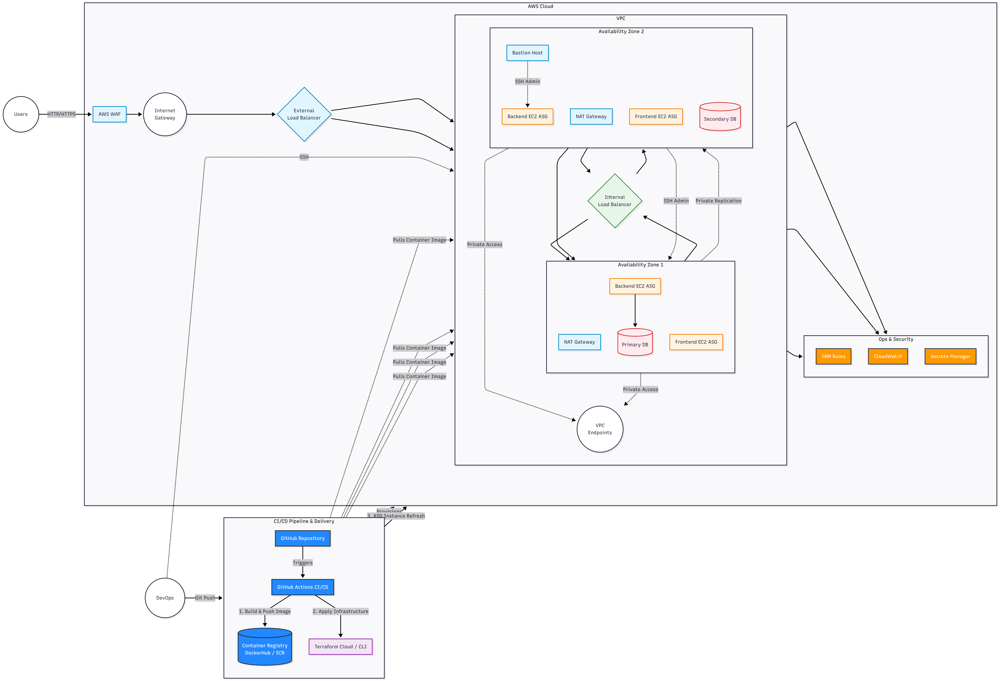

# Goal Tracker — Enterprise AWS 3-Tier Architecture

> **A production-grade cloud architecture demonstration deploying a containerized full-stack application. Engineered with Terraform for high availability, strict network isolation, and automated deployment lifecycles.**

[](https://www.terraform.io/)
[](https://aws.amazon.com/)
[](https://github.com/features/actions)
[](https://www.docker.com/)
[](https://go.dev/)
[](https://nodejs.org/)

## Architecture

### AWS 3-Tier Multi-AZ Architecture

<p align="center">
  
</p>
## 📌 Executive Summary

This repository houses the infrastructure and application code for a resilient 3-tier web platform. Moving beyond a standard single-server deployment, this project demonstrates core DevOps, Cloud Engineering, and Site Reliability Engineering (SRE) principles. 

The system securely serves a Node.js frontend and a Go REST API using isolated VPC subnets, dual load balancing, horizontal auto-scaling, and a private PostgreSQL database layer.

Infrastructure as Code (IaC): 100% of the AWS infrastructure is provisioned using modular, state-driven Terraform.
Defense-in-Depth Networking: The compute and data tiers reside in private subnets with no direct internet ingress, shielded by strict Security Group boundaries and dual Application Load Balancers (ALBs).
Elastic Scalability: EC2 Auto Scaling Groups dynamically adjust capacity based on target-tracking CPU utilization policies.
Automated Delivery: Application updates are decoupled from infrastructure provisioning, utilizing parallel CI/CD pipelines to build, tag, and publish Docker images.
Secure Operations: Administrative access is brokered through a public Bastion host, while dynamic runtime secrets are retrieved via AWS Secrets Manager using IAM instance profiles.---

## 🛠 Tech Stack & Tools

| Category | Technologies Used |
| :--- | :--- |
| **Cloud Provider** | Amazon Web Services (VPC, EC2, ALB, RDS, Secrets Manager, IAM, CloudWatch) |
| **Infrastructure as Code** | HashiCorp Terraform |
| **Containers & CI/CD** | Docker, Docker Compose, GitHub Actions |
| **Backend API** | Go, Gin Framework |
| **Frontend UI** | Node.js, Express |
| **Database** | PostgreSQL |

---

## 📂 Repository Architecture

The project is deliberately structured to separate application logic from cloud infrastructure, mirroring enterprise monorepo patterns.

*   `/terraform-infra`: Reusable Terraform modules (`vpc`, `alb`, `rds`, `iam`, etc.) and environment-specific configurations (`/environments/dev`)[cite: 1].
*   `/backend`: Go REST API source code, dependency definitions (`go.mod`), and multi-stage `Dockerfile`[cite: 1].
*   `/frontend`: Node.js presentation layer, static assets, and optimized `Dockerfile`[cite: 1].
*   `/docker-local-deployment`: Docker Compose configuration (`docker-compose.yml`) and database initialization scripts for zero-cost local development[cite: 1].
*   `/.github/workflows`: CI/CD automation pipelines for container image delivery.

---

## 🚀 Deployment Lifecycle

### Local Environment
Developers can spin up the entire application stack locally using Docker Compose without requiring AWS credentials or incurring cloud costs[cite: 1].
```bash
cd docker-local-deployment
docker compose up -d
```
AWS Cloud Environment
Continuous Integration: Merging application code to the main branch triggers a GitHub Actions workflow. This builds the Docker images, applies an immutable Git commit SHA tag, and pushes the artifacts to the container registry.

Infrastructure Provisioning: Terraform initializes and applies the modular infrastructure state[cite: 1]. Shell scripts (deploy.sh, backend_user_data.sh) are maintained in the repository for bootstrapping and local testing[cite: 1].


cd terraform-infra/environments/dev
terraform init
terraform apply -var-file="terraform.tfvars"

Zero-Downtime Updates: To deploy a new application version, an ASG Instance Refresh is triggered, systematically replacing old EC2 instances with newly bootstrapped nodes pulling the latest SHA-pinned image.

📈 Enterprise Hardening Roadmap
While this project successfully demonstrates advanced cloud architecture, migrating this specific implementation to a production-grade enterprise environment would require the following architectural evolutions:

Immutable Machine Images: Transitioning away from runtime EC2 user_data bootstrapping[cite: 1] toward using HashiCorp Packer to bake Docker, the AWS CLI, and security agents into an immutable AMI, significantly reducing ASG spin-up latency.

Remote State Management: Migrating the local Terraform state to a remote backend (AWS S3) with state locking (DynamoDB) to facilitate safe, multi-developer collaboration and CI/CD infrastructure automation[cite: 1].

Secret Injection: Evolving the current AWS Secrets Manager integration from environment variable population[cite: 1] to direct in-memory secret injection via AWS Parameter Store or HashiCorp Vault to prevent credential exposure via container inspection.

Private Artifact Registries: Shifting from public Docker Hub distribution to Amazon Elastic Container Registry (ECR), utilizing VPC endpoints to keep all image pulls completely within the private AWS backbone.

Edge Security: Attaching an AWS Web Application Firewall (WAF) to the public ALB and enforcing end-to-end TLS encryption via AWS Certificate Manager (ACM).

👨‍💻 Author
Nafees Khan

Cloud / DevOps Engineer
